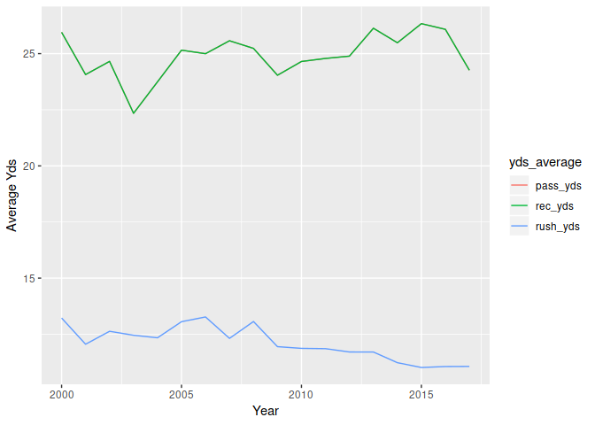
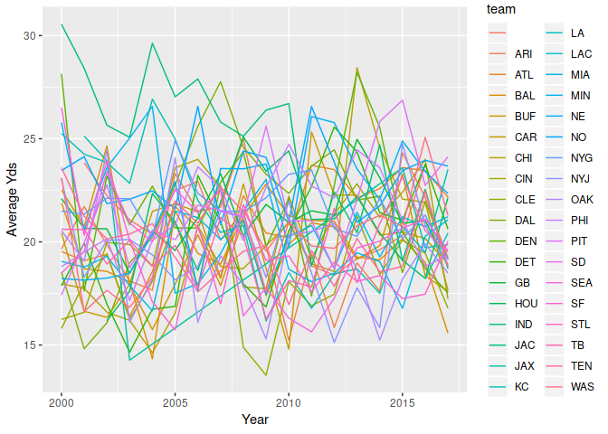

strutured data
==============

``` r
nfl_yds_yer <- nfl %>% 
  mutate_if(is.numeric, funs(ifelse(is.na(.), 0, .))) %>% 
  group_by(game_year, team) %>% 
  summarise(rush_yds = mean(rush_yds, na.rm = T),
            pass_yds = mean(pass_yds, na.rm = T),
            rec_yds = mean(pass_yds, na.rm = T),
            ) %>%
  ungroup 

## wide to long
nfl_yds_yer_plot <- nfl_yds_yer %>% 
  gather(key = "yds_average", value = "avg", -c(game_year, team))
```

Plots
=====

``` r
## plots
nfl_yds_yer_plot %>% 
  group_by(game_year, yds_average) %>% 
  summarise(avg_sum = mean(avg)) %>% 
  ggplot(mapping = aes(x = game_year, y = avg_sum)) +
  geom_line(aes(color = yds_average)) +
  labs(x = "Year", y = "Average Yds")
```



``` r
nfl_yds_yer_plot %>% 
  group_by(game_year, team) %>% 
  summarise(avg_sum = mean(avg)) %>% 
  ggplot(mapping = aes(x = game_year, y = avg_sum)) +
  geom_line(aes(color = team)) +
  labs(x = "Year", y = "Average Yds")
```


