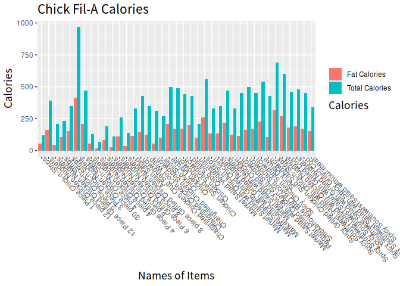
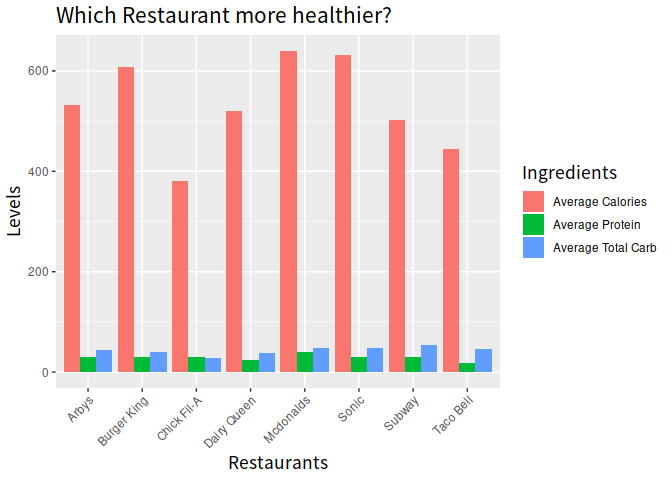

Libraries
---------

``` r
library(tidyverse)
```

    ## ─ Attaching packages ─────────────────────────────────── tidyverse 1.2.1 ─

    ## ✔ ggplot2 3.0.0     ✔ purrr   0.2.5
    ## ✔ tibble  1.4.2     ✔ dplyr   0.7.6
    ## ✔ tidyr   0.8.1     ✔ stringr 1.3.1
    ## ✔ readr   1.1.1     ✔ forcats 0.3.0

    ## ─ Conflicts ───────────────────────────────────── tidyverse_conflicts() ─
    ## ✖ dplyr::filter() masks stats::filter()
    ## ✖ dplyr::lag()    masks stats::lag()

``` r
library(ggplot2)
```

Import Data
-----------

``` r
ff <- read.csv(file = "~/Documents/tidytuesday_JZ/data/2018-09-04/fastfood_calories.csv")
glimpse(ff)
```

    ## Observations: 527
    ## Variables: 17
    ## $ restaurant  <fct> Mcdonalds, Mcdonalds, Mcdonalds, Mcdonalds, Mcdona...
    ## $ item        <fct> Artisan Grilled Chicken Sandwich, Single Bacon Smo...
    ## $ calories    <int> 380, 840, 1130, 750, 920, 540, 300, 510, 430, 770,...
    ## $ cal_fat     <int> 60, 410, 600, 280, 410, 250, 100, 210, 190, 400, 1...
    ## $ total_fat   <int> 7, 45, 67, 31, 45, 28, 12, 24, 21, 45, 18, 34, 20,...
    ## $ sat_fat     <dbl> 2.0, 17.0, 27.0, 10.0, 12.0, 10.0, 5.0, 4.0, 11.0,...
    ## $ trans_fat   <dbl> 0.0, 1.5, 3.0, 0.5, 0.5, 1.0, 0.5, 0.0, 1.0, 2.5, ...
    ## $ cholesterol <int> 95, 130, 220, 155, 120, 80, 40, 65, 85, 175, 40, 9...
    ## $ sodium      <int> 1110, 1580, 1920, 1940, 1980, 950, 680, 1040, 1040...
    ## $ total_carb  <int> 44, 62, 63, 62, 81, 46, 33, 49, 35, 42, 38, 48, 48...
    ## $ fiber       <int> 3, 2, 3, 2, 4, 3, 2, 3, 2, 3, 2, 3, 3, 5, 2, 2, 3,...
    ## $ sugar       <int> 11, 18, 18, 18, 18, 9, 7, 6, 7, 10, 5, 11, 11, 11,...
    ## $ protein     <int> 37, 46, 70, 55, 46, 25, 15, 25, 25, 51, 15, 32, 42...
    ## $ vit_a       <int> 4, 6, 10, 6, 6, 10, 10, 0, 20, 20, 2, 10, 10, 10, ...
    ## $ vit_c       <int> 20, 20, 20, 25, 20, 2, 2, 4, 4, 6, 0, 10, 20, 15, ...
    ## $ calcium     <int> 20, 20, 50, 20, 20, 15, 10, 2, 15, 20, 15, 35, 35,...
    ## $ salad       <fct> Other, Other, Other, Other, Other, Other, Other, O...

Note that the `echo = FALSE` parameter was added to the code chunk to
prevent printing of the R code that generated the plot.

Clean Data
----------

### Look at Chick-fil-A Nutrition

``` r
ff$restaurant %>% unique
```

    ## [1] Mcdonalds   Chick Fil-A Sonic       Arbys       Burger King Dairy Queen
    ## [7] Subway      Taco Bell  
    ## 8 Levels: Arbys Burger King Chick Fil-A Dairy Queen Mcdonalds ... Taco Bell

``` r
(ff_plot <- ff %>% 
  filter(restaurant == "Chick Fil-A") %>% 
  select(item, calories, cal_fat) %>% 
  arrange(calories) %>% 
  gather(cals, cal_level, -item)
    )
```

    ##                                            item     cals cal_level
    ## 1               4 Piece Grilled Chicken Nuggets calories        70
    ## 2               6 Piece Grilled Chicken Nuggets calories       110
    ## 3                        1 Piece Chick-n-Strips calories       120
    ## 4                       4 piece Chicken Nuggets calories       130
    ## 5               8 piece Grilled Chicken Nuggets calories       140
    ## 6                       6 piece Chicken Nuggets calories       190
    ## 7              12 Piece Grilled Chicken Nuggets calories       210
    ## 8                       Market Salad Vegetarian calories       210
    ## 9                        2 Piece Chick-n-Strips calories       230
    ## 10                      8 piece Chicken Nuggets calories       260
    ## 11                               Chick-n-Slider calories       270
    ## 12                 Chargrilled Chicken Sandwich calories       310
    ## 13                                  Asian Salad calories       330
    ## 14      Market Salad with Spicy Grilled Chicken calories       330
    ## 15            Market Salad with Grilled Chicken calories       330
    ## 16           Spicy Southwest Salad without meat calories       340
    ## 17                       3 Piece Chick-n-Strips calories       350
    ## 18                Chargrilled Chicken Cool Wrap calories       350
    ## 19            Market Salad with Grilled Nuggets calories       350
    ## 20                     12 piece Chicken Nuggets calories       390
    ## 21            Chargrilled Chicken Club Sandwich calories       430
    ## 22           Spicy Grilled Chicken Sub Sandwich calories       430
    ## 23                                   Cobb Salad calories       430
    ## 24                             Chicken Sandwich calories       440
    ## 25         Regular Grilled Chicken Sub Sandwich calories       450
    ## 26                       Spicy Chicken Sandwich calories       450
    ## 27 Spicy Southwest Salad with Spicy Grilled Cod calories       450
    ## 28       Spicy Southwest Salad with Grilled Cod calories       460
    ## 29                       4 piece Chick-n-Strips calories       470
    ## 30                    Market Salad with Nuggets calories       470
    ## 31   Spicy Southwest Salad with Grilled Nuggets calories       480
    ## 32                       Chicken Salad Sandwich calories       490
    ## 33                               Chicken Deluxe calories       500
    ## 34                Smokehouse BBQ Bacon Sandwich calories       500
    ## 35                                 Spicy Deluxe calories       540
    ## 36             Market Salad with Chick-n-Strips calories       560
    ## 37   Spicy Southwest Salad with Chicken Nuggets calories       600
    ## 38    Spicy Southwest Salad with Chick-n-Strips calories       690
    ## 39                     30 piece Chicken Nuggets calories       970
    ## 40              4 Piece Grilled Chicken Nuggets  cal_fat        18
    ## 41              6 Piece Grilled Chicken Nuggets  cal_fat        27
    ## 42                       1 Piece Chick-n-Strips  cal_fat        54
    ## 43                      4 piece Chicken Nuggets  cal_fat        54
    ## 44              8 piece Grilled Chicken Nuggets  cal_fat        36
    ## 45                      6 piece Chicken Nuggets  cal_fat        81
    ## 46             12 Piece Grilled Chicken Nuggets  cal_fat        45
    ## 47                      Market Salad Vegetarian  cal_fat        99
    ## 48                       2 Piece Chick-n-Strips  cal_fat       108
    ## 49                      8 piece Chicken Nuggets  cal_fat       110
    ## 50                               Chick-n-Slider  cal_fat        99
    ## 51                 Chargrilled Chicken Sandwich  cal_fat        54
    ## 52                                  Asian Salad  cal_fat       117
    ## 53      Market Salad with Spicy Grilled Chicken  cal_fat       126
    ## 54            Market Salad with Grilled Chicken  cal_fat       135
    ## 55           Spicy Southwest Salad without meat  cal_fat       153
    ## 56                       3 Piece Chick-n-Strips  cal_fat       153
    ## 57                Chargrilled Chicken Cool Wrap  cal_fat       126
    ## 58            Market Salad with Grilled Nuggets  cal_fat       135
    ## 59                     12 piece Chicken Nuggets  cal_fat       162
    ## 60            Chargrilled Chicken Club Sandwich  cal_fat       144
    ## 61           Spicy Grilled Chicken Sub Sandwich  cal_fat       108
    ## 62                                   Cobb Salad  cal_fat       198
    ## 63                             Chicken Sandwich  cal_fat       171
    ## 64         Regular Grilled Chicken Sub Sandwich  cal_fat       117
    ## 65                       Spicy Chicken Sandwich  cal_fat       171
    ## 66 Spicy Southwest Salad with Spicy Grilled Cod  cal_fat       171
    ## 67       Spicy Southwest Salad with Grilled Cod  cal_fat       180
    ## 68                       4 piece Chick-n-Strips  cal_fat       207
    ## 69                    Market Salad with Nuggets  cal_fat       216
    ## 70   Spicy Southwest Salad with Grilled Nuggets  cal_fat       189
    ## 71                       Chicken Salad Sandwich  cal_fat       170
    ## 72                               Chicken Deluxe  cal_fat       207
    ## 73                Smokehouse BBQ Bacon Sandwich  cal_fat       162
    ## 74                                 Spicy Deluxe  cal_fat       225
    ## 75             Market Salad with Chick-n-Strips  cal_fat       261
    ## 76   Spicy Southwest Salad with Chicken Nuggets  cal_fat       270
    ## 77    Spicy Southwest Salad with Chick-n-Strips  cal_fat       315
    ## 78                     30 piece Chicken Nuggets  cal_fat       414

``` r
p1 <- ff_plot %>% ggplot(aes(x = item, y = cal_level, fill = cals))

p1 +
  geom_bar(position="dodge", stat="identity")+
  xlab("Names of Items") +
  ylab("Calories") +
  labs(title = "Chick Fil-A Calories")+
  scale_color_discrete(labels = c("Total", "Calories from fat"))+
  theme(title = element_text(family = "WenQuanYi", size = 13),
        axis.text.x = element_text(angle =135, hjust = 1))+
  guides(fill=guide_legend(title="Calories", title.position = "bottom"))+
  scale_fill_discrete(labels = c("Fat Calories", "Total Calories"))
```



Look at which resturant has low average calories
------------------------------------------------

``` r
ff_plot2 <- ff %>% 
  select(restaurant, calories, total_carb, protein) %>% 
  group_by(restaurant) %>% 
  mutate_at(vars(calories, total_carb, protein), funs(mean(., na.rm = T))) %>% 
  distinct() %>% 
  ungroup() %>% 
  gather(Ingredients, levels, -restaurant)

p2 <- ff_plot2 %>% ggplot(aes(x = restaurant, y = levels, fill = Ingredients))

p2 +
  geom_bar(position="dodge", stat="identity")+
  labs(x = "Restaurants", y="Levels", title = "Which Restaurant more healthier?")+
  scale_fill_discrete(labels = c("Average Calories", "Average Protein", "Average Total Carb"))+
  theme(title = element_text(family = "WenQuanYi", size = 13),
        axis.text.x = element_text(angle =135, hjust = 1))
```


